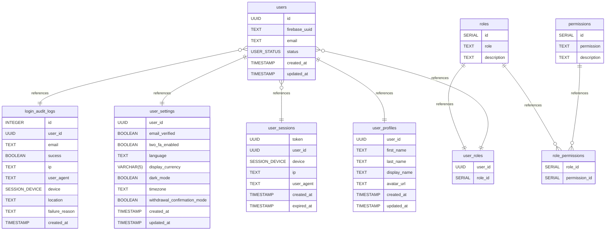

# ezex user documentation
database schema designed by [drawdb](https://www.drawdb.app/)

## Summary

- [Introduction](#introduction)
- [Database Type](#database-type)
- [Table Structure](#table-structure)
	- [users](#users)
	- [user_profiles](#user_profiles)
	- [roles](#roles)
	- [permissions](#permissions)
	- [user_roles](#user_roles)
	- [role_permissions](#role_permissions)
	- [user_sessions](#user_sessions)
	- [user_settings](#user_settings)
	- [login_audit_logs](#login_audit_logs)
- [Relationships](#relationships)
- [Database Diagram](#database-Diagram)

## Introduction

## Database type

- **Database system:** PostgreSQL
## Table structure

### users

| Name        | Type          | Settings                      | References                    | Note                           |
|-------------|---------------|-------------------------------|-------------------------------|--------------------------------|
| **id** | UUID | 🔑 PK, not null , unique | users_id_fk,users_id_fk,users_id_fk,users_id_fk,users_id_fk | |
| **firebase_uuid** | TEXT | not null , unique |  | |
| **email** | TEXT | not null , unique |  | |
| **status** | USER_STATUS | not null  |  | |
| **created_at** | TIMESTAMP | not null  |  | |
| **updated_at** | TIMESTAMP | not null  |  | | 

#### Indexes
| Name | Unique | Fields |
|------|--------|--------|
| idx_users_email |  | email |
| idx_users_firebase_uuid |  | firebase_uuid |
| idx_users_status |  | status |
### user_profiles

| Name        | Type          | Settings                      | References                    | Note                           |
|-------------|---------------|-------------------------------|-------------------------------|--------------------------------|
| **user_id** | UUID | 🔑 PK, not null  |  | |
| **first_name** | TEXT | not null  |  | |
| **last_name** | TEXT | not null  |  | |
| **display_name** | TEXT | not null  |  | |
| **avatar_url** | TEXT | not null  |  | |
| **created_at** | TIMESTAMP | not null  |  | |
| **updated_at** | TIMESTAMP | not null  |  | | 

### roles

| Name        | Type          | Settings                      | References                    | Note                           |
|-------------|---------------|-------------------------------|-------------------------------|--------------------------------|
| **id** | SERIAL | 🔑 PK, not null , unique | roles_id_fk,roles_id_fk |admin, moderator, user, support |
| **role** | TEXT | not null , unique |  |admin, moderator, user, support |
| **description** | TEXT | not null  |  | | 

### permissions

| Name        | Type          | Settings                      | References                    | Note                           |
|-------------|---------------|-------------------------------|-------------------------------|--------------------------------|
| **id** | SERIAL | 🔑 PK, not null , unique | permissions_id_fk | |
| **permission** | TEXT | not null , unique |  |for example user:read or user:write |
| **description** | TEXT | not null  |  | | 

#### Indexes
| Name | Unique | Fields |
|------|--------|--------|
| idx_permissions_permission |  | permission |
### user_roles

| Name        | Type          | Settings                      | References                    | Note                           |
|-------------|---------------|-------------------------------|-------------------------------|--------------------------------|
| **user_id** | UUID | not null  |  | |
| **role_id** | SERIAL | not null  |  | | 

### role_permissions

| Name        | Type          | Settings                      | References                    | Note                           |
|-------------|---------------|-------------------------------|-------------------------------|--------------------------------|
| **role_id** | SERIAL | not null  |  | |
| **permission_id** | SERIAL | not null  |  | | 

### user_sessions

| Name        | Type          | Settings                      | References                    | Note                           |
|-------------|---------------|-------------------------------|-------------------------------|--------------------------------|
| **token** | UUID | 🔑 PK, not null , unique |  | |
| **user_id** | UUID | not null  |  | |
| **device** | SESSION_DEVICE | not null  |  | |
| **ip** | TEXT | not null  |  | |
| **user_agent** | TEXT | not null  |  | |
| **created_at** | TIMESTAMP | not null  |  | |
| **expired_at** | TIMESTAMP | not null  |  | | 

#### Indexes
| Name | Unique | Fields |
|------|--------|--------|
| idx_sessions_user_id |  | user_id |
| idx_sessions_expired_at |  | expired_at |
### user_settings

| Name        | Type          | Settings                      | References                    | Note                           |
|-------------|---------------|-------------------------------|-------------------------------|--------------------------------|
| **user_id** | UUID | 🔑 PK, not null , unique |  | |
| **email_verified** | BOOLEAN | not null , default: false |  | |
| **two_fa_enabled** | BOOLEAN | not null , default: false |  | |
| **language** | TEXT | not null  |  | |
| **display_currency** | VARCHAR(5) | not null , default: USD |  | |
| **dark_mode** | BOOLEAN | not null , default: false |  | |
| **timezone** | TEXT | not null  |  | |
| **withdrawal_confirmation_mode** | BOOLEAN | not null , default: false |  | |
| **created_at** | TIMESTAMP | not null  |  | |
| **updated_at** | TIMESTAMP | not null  |  | | 

### login_audit_logs

| Name        | Type          | Settings                      | References                    | Note                           |
|-------------|---------------|-------------------------------|-------------------------------|--------------------------------|
| **id** | INTEGER | 🔑 PK, not null , unique, autoincrement |  | |
| **user_id** | UUID | not null  |  | |
| **email** | TEXT | not null  |  |Helpful for failed login attempts |
| **sucess** | BOOLEAN | not null , default: false |  |Whether login was successful |
| **ip** | TEXT | not null  |  | |
| **user_agent** | TEXT | not null  |  | |
| **device** | SESSION_DEVICE | not null  |  | |
| **location** | TEXT | not null  |  | |
| **failure_reason** | TEXT | not null  |  |"wrong password", "token expired", etc. |
| **created_at** | TIMESTAMP | not null  |  | | 

#### Indexes
| Name | Unique | Fields |
|------|--------|--------|
| idx_login_user_id |  | user_id |
| idx_login_email |  | email |
| idx_login_created_at |  | created_at |
## Relationships

- **users to user_profiles**: one_to_one
- **roles to user_roles**: one_to_one
- **users to user_roles**: one_to_many
- **roles to role_permissions**: many_to_one
- **permissions to role_permissions**: many_to_one
- **users to user_sessions**: one_to_many
- **users to user_settings**: one_to_one
- **users to login_audit_logs**: one_to_many

## Database Diagram

